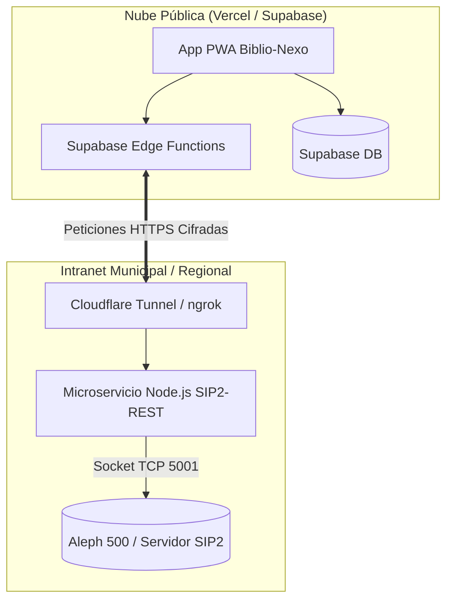

# Arquitectura de Integración: Biblio-Nexo & Aleph 500 (Vía SIP2)

Como **Biblio-Nexo** funciona en la nube (Vercel + Supabase) y **Aleph 500** es un sistema típicamente albergado en la intranet municipal o regional (y que se comunica por sockets TCP a través del protocolo **SIP2**), necesitamos establecer un puente seguro.

La nueva arquitectura no requerirá exponer directamente la base de datos de Aleph a Internet ni reescribir Biblio-Nexo. Utilizaremos un modelo de **Túnel + Microservicio SIP2**.

## 1. Topología del Sistema

## 2. Requisitos para el Equipo de Informática (IT Municipal)

Para implementar esta fase, TI del municipio debe proveer lo siguiente:

1. **IP y Puerto SIP2**: La dirección interna del servidor Aleph 500 que atiende peticiones SIP2 (ej. `192.168.1.50:5001`).
2. **Credenciales SIP2**: 
   - `Location Code` (ID de sucursal).
   - `Terminal Password` (Contraseña de conexión SIP2).
3. **Máquina Virtual Ligera**: Un equipo o contenedor en la intranet con acceso al servidor Aleph y salida a Internet.
   - Aquí instalaremos el **Microservicio SIP2-REST** y **cloudflared** (Cloudflare Tunnel).
   - *Este túnel realiza conexiones salientes (outbound) únicamente. No requiere abrir puertos entrantes en el firewall de la municipalidad, manteniendo la red blindada.*

## 3. Flujo de Operación (Cómo Biblio-Nexo usa Aleph)

Biblio-Nexo actuará como el "Self-Check" o "Punto de Préstamo".
Cuando un bibliotecario escanee un libro en Biblio-Nexo:

1. El frontend web solicita la validación a la base de datos central.
2. Una **Supabase Edge Function** recibe la solicitud y hace un `fetch` hacia la URL pública cifrada del túnel.
3. El Túnel enruta el tráfico hacia el **Microservicio SIP2-REST** en la intranet.
4. El Microservicio transforma el JSON a un mensaje SIP2 nativo (`11` Checkout / `09` Checkin) y se lo envía a Aleph por TCP.
5. Aleph responde si el lector existe, si tiene deudas o si el préstamo es exitoso (`12` Checkout Response / `10` Checkin Response).
6. La respuesta se traduce a JSON, viaja de vuelta a Supabase y se consolida en nuestra base IndexedDB local para la UI.

## 4. Próximos Pasos de Desarrollo (Fase 2)

- [ ] Programar el **Microservicio SIP2-REST** en Node.js (se puede usar la librería `sip2` de NPM o escribir un cliente de Sockets simple).
- [ ] Construir la **Supabase Edge Function** (`aleph-gateway`) que actúe como cliente REST del túnel.
- [ ] Añadir una migración a la BD para incluir una columna `id_aleph` opcional en la tabla de `libros` y `lectores` para el cruce de datos.
